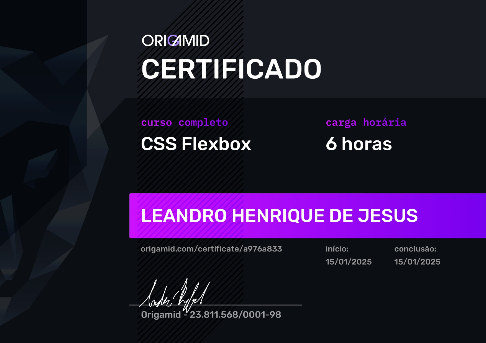

### Olá eu Sou Leandro Henrique de Jesus! 👋🏽

💼 - Trabalho: Orientador Educacional (06/2022 - Atual). 
💼 - Trabalho: Analista de Suporte II (09/2021 - 05/2024). 
👨🏽‍🎓 - Formação: 2014 - Gestão da Tecnologia da Informação / 2021 - Analise e Desenvolvimento de Sistema. 
👨🏽‍🎓 - Cursando: Ciências da Computação. 
🎒 - Estudo: HTML5/CSS3, JavaScript, Bootstrap.

#

### 🧑🏽‍💻 Sobre:

Graduado em Análise e Desenvolvimento de Sistemas e bacharelando em Ciências da Computação, com experiência em suporte técnico e certificações Microsoft (MS-900, AZ-900, AI-900, SC-900) e ITIL v4. Atuei em ambientes corporativos e educacionais, sempre com foco em resolver problemas de forma ágil e eficiente. Tenho interesse em desenvolvimento web, cloud computing e inteligência artificial aplicada, áreas nas quais busco construir minha carreira, aplicando tanto minha experiência prática quanto meu aprendizado contínuo

## 

### 👨🏽‍💻 Tecnologias  

##

### 📘 Cursos e Certificações

Descrição   | Instituição   | Ano | Tipo | |
--------- | --------- | ------ | ------ | ------
🏅 UI Design para Iniciantes | Origamid | 2023 | Certificado |  |
🏅 ITIL V4 Fundation Certified | Via Virtual | 2024 | Certificação |  |
🏅 AZ-900 | Microsoft | 2024 | Certificação |  |
🏅 MS-900 | Microsoft | 2024 | Certificação |  |
🏅 IA-900 | Microsoft | 2025 | Certificação |  |
🏅 SC-900 | Microsoft | 2025 | Certificação |  |
🏅 Applied Skills| Microsoft | 2025 | Certificação |  |
🏅 CSS flexbox | Origamid | 2025 | Certificado |  |
🏅 HTML E CSS | Origamid | Cursando | Certificado |

##

### 🌐 Minhas Redes.

##

### ⚙️ Estatísticas de Aprendizagem GitHub.

##
